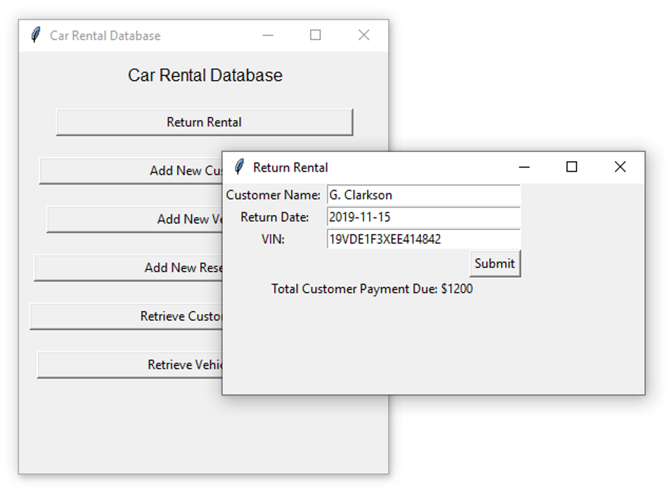

# Car Rental Database
Created a GUI using Python to access a database with information for a Car Rental Company 

## Tools Used
- Python
- SQLite3
- Tkinter (For GUI)


## Loading Data into Database
Removed each header row in each .csv file with the data

<br/>
Commands used to load data into CarRental2019.db file:


```
  .schema
  .read main.sql
  .mode csv
  .import CUSTOMER.csv CUSTOMER
  .import RATE.csv RATE
  .import RENTAL.csv RENTAL
  .import VEHICLE.csv VEHICLE
  .header on
  .mode column
```

## How to Run GUI
To run the graphical user interface for the Car Rental Database, type in:

```
python3 gui.py
```

into the terminal and ensure 
- Python and Tkinter are installed on your machine
- the code is being ran in the same directory as the CarRental2019.db

## Task 1: Execute Queries on the CarRental2019 Database Tables

### Query 1:

```
-- Add an extra column ‘Returned’ to the RENTAL table. 
-- Values will be 0-for non-returned cars, and 1-for returned. 
-- Then update the ‘Returned’ column with '1' for all records that they have a payment date and with '0' for those that they do not have a payment date.

ALTER TABLE RENTAL ADD COLUMN Returned INTEGER DEFAULT 0;
UPDATE RENTAL
SET Returned = 1
WHERE PaymentDate <> 'NULL';

```

Output:


<br/>

### Query 2:

```
--Create a view vRentalInfo that retrieves all information per rental.
CREATE VIEW vRentalInfo
AS SELECT R.OrderDate, R.StartDate, R.ReturnDate, CAST(JULIANDAY(R.ReturnDate)-JULIANDAY(R.StartDate) AS INTEGER) AS TotalDays, R.VehicleID AS VIN, V.CarDescription AS Vehicle,
CASE 
  WHEN V.CarType = 1 THEN 'Compact'
  WHEN V.CarType = 2 THEN 'Medium'
  WHEN V.CarType = 3 THEN 'Large'
  WHEN V.CarType = 4 THEN 'SUV'
  WHEN V.CarType = 5 THEN 'Truck'
  WHEN V.CarType = 6 THEN 'Van'  
END AS Type,
CASE 
  WHEN V.CarCategory = 0 THEN 'Basic'
  WHEN V.CarCategory = 1 THEN 'Luxury'
END AS Category,
R.CustID AS CustomerID, C.CustName AS CustomerName, R.TotalAmount AS OrderAmount, 
CASE  
  WHEN R.PaymentDate = 'NULL' THEN R.TotalAmount
  WHEN R.PaymentDate <> 'NULL' THEN 0
END AS RentalBalance
   FROM RENTAL AS R JOIN VEHICLE AS V ON R.VehicleID = V.VehicleID
        JOIN CUSTOMER AS C ON R.CustID = C.CustID 
   ORDER BY StartDate ASC;

--Result
SELECT *
FROM vRentalInfo;

--How many rows returned
SELECT COUNT(OrderDate) AS Number_of_Rows
FROM vRentalInfo;

```

Output:


## Task 2: Graphical User Interface for CarRental2019 Database
- The graphical user interface, GUI was created using Python, Tkinter and SQLite3. 

- The following includes the execute queries Python for each requirement in Task 2 using the GUI. 

- See the Readme.docx in the Code folder for installation details.

- Additional information about how each requirement was implemented and code snippets can be found in the Report.pdf file

<br/>

### Requirement 1:

Add information about a new customer. Customer ID is not provided in the query.


- To add information about a new customer, the user clicks the “Add New Customer” button on the main “Car Rental Database” window and types the query’s input parameters and confirms by clicking the “Add Customer” button. 

- Feedback to the user about the information added is displayed below the button.


The information about the new customer is added to the database


<br/>

### Requirement 2:

Add all the information about a new vehicle.


- To add information about a new vehicle, the user clicks the “Add New Vehicle” button on the main “Car Rental Database” window and types the query’s input parameters and confirms by clicking the “Add Vehicle” button


The information about the new vehicle is added to the database


<br/>

### Requirement 3:

Add all the information about a new rental reservation.

This finds a free vehicle of the appropriate type and category for a specific rental period. Assumed that the customer has the right to either pay at the order or return date.


<br/>


Viewing available vehicles:


Window to add a new rental:


Database prior to adding a rental reservation (Rental Table)


Adding Rental


Database AFTER adding rental reservation (Rental Table)


<br/>

### Requirement 4:

Handle the return of a rented car. 

Transaction prints the total customer payment due for that rental, enters it in the database, and updates the Returned attribute accordingly. Retrieves a rental by the return date, customer name, and vehicle information.

<br/>


To return a rental, the user clicks the “Return Rental” button on the main “Car Rental Database” window and types the query’s input parameters for the rental information. The user confirms by clicking the “Submit” button. Feedback to the user about the payment made is displayed below the button.




Before rental return update:


After rental return update:


<br/>

### Requirement 5a:

List for every customer the ID, name, and if there is any remaining balance. 

The user has the right to search either by a customer’s ID, name, part of the name, or to run the query with no filters/criteria. The amount is in US dollars. For customers with zero (0) or NULL balance, returns zero dollars ($0.00). In the case that the user decides not to provide any filters, order the results based on the balance amount. Returns meaningful attribute names and all records.

<br/>

Displaying remaining balance for J. Brown


Displaying remaining balance for all customers (Nothing was entered)


<br/>

### Requirement 5b:

List for every vehicle the VIN, the description, and the average DAILY price. 

The user has the right either to search by the VIN, vehicle’s description, part of the description, or to run the query with no filters/criteria. An example criterion would be all ‘BMW’ vehicles. The amount needs to be in US dollars. The average DAILY price derives from the rental table, and the amount needs to have two decimals as well as the dollar ‘$’ sign. For vehicles that they do not have any rentals, substitute the NULL value with a ‘Non-Applicable’ text. Returns meaningful attribute names. In the case that the user decides not to provide any filters, order the results based on the average daily price.


